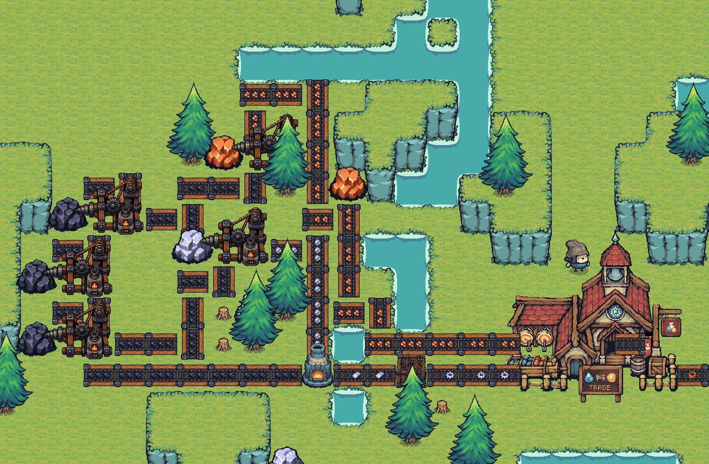
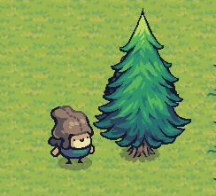
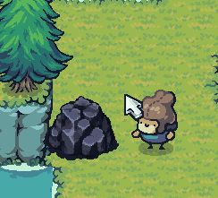
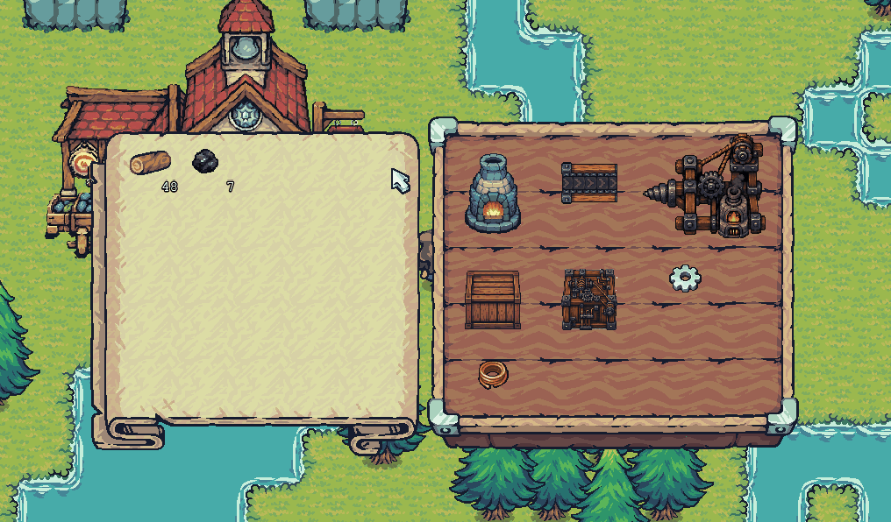
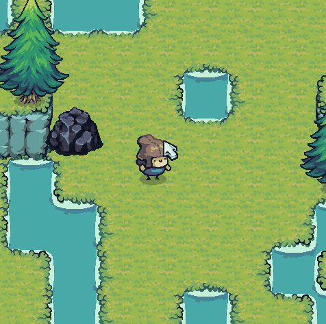
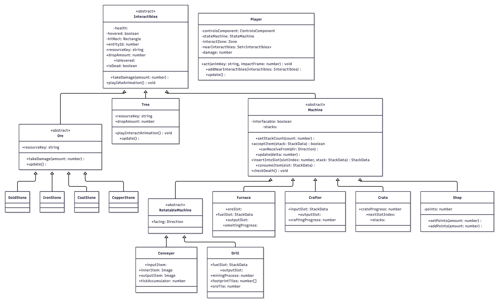

# PhaserCorp

A 2D top-down factory builder game. Mine raw resources, smelt them into
materials, and craft components. Grow up and automate your production to finally
pay off all your debts to PhaserCorp.

Built with [Phaser 3](https://phaser.io/), TypeScript and Vite.



## Goal

You start **1,000,000 in debt** to PhaserCorp (a balance of -1,000,000). To pay it
off, sell resources and crafted goods at the shop: drop items into it (by hand or
fed in by a conveyor) and their value is added to your balance. The higher up the
production chain an item is, the more it sells for, so automating plates, gears
and wire is the fastest way out of the red. Reach a balance of 0 to clear your
debt and win.

## How to play

Play it right now in your browser:

**https://hleonardoafonso.github.io/PhaserCorp/**

## Installation

Clone the repository and then do the following commands:

```bash
npm install
npm run dev
```

## Supported Languages (i18n)

- English 🇬🇧
- Português 🇵🇹
- Français 🇫🇷

## Controls

| Key             | Action                   |
| --------------- | ------------------------ |
| `WASD` / Arrows | Move the player          |
| `Q`             | Save your progress       |
| `Z`             | Toggle demolish mode     |
| `X`             | Cancel a build placement |
| `E`             | Open / close inventory   |

## Collecting resources

Chopping trees gives you 16 logs per tree.



Each mining hit gives you one ore.



All resources available:

- Wood
- Coal
- Iron
- Copper
- Gold

## Crafting

Recipes:

The first arrow represents **smelting** the ore (in a furnace), and the second
arrow represents the **craft**, either done manually or automated by a crafter
machine.

```
Iron Ore -> Iron Plate -> Iron Gears
Copper Ore -> Copper Plate -> Copper Wire
```

Machines:

| Machine  | Cost                             |
| -------- | -------------------------------- |
| Furnace  | 5 iron ore                       |
| Drill    | 3 gears + 5 iron plates + 5 wood |
| Crafter  | 5 gears + 9 copper wire + 3 wood |
| Crate    | 3 wood                           |
| Conveyor | 1 gear + 1 wood                  |



## Coal beginner setup

There is a coal starter layout that automates getting a lot of coal early
(Dev's gift).



## Interactible Entities Diagram

We aimed for the cleanest way to model each interactive entity in the game. The
diagram below shows the classes and how they relate to one another.



## Credits

- Visual assets from the free "Tiny Swords" asset pack:
  https://pixelfrog-assets.itch.io/tiny-swords
- Assets not included in the asset pack mentioned above were created using
  generative neural networks, with editing by the authors.
- Audio assets from [pixabay.com](https://pixabay.com/).
